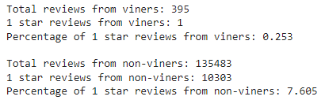

# Amazon_Vine_Analysis

## Overview
The following analysis investigates the potential bias of reviewers who are paid to review an item that they have purchased. To investigate this, a video game review database was pulled from Amazon and analyzed.

## Results
- There were a total of 395 vine reviews and a total of 135483 non-vine reviews.
- There were 48 vine 5 star reviews. There were 15663 non-vine 5 star reviews
- Vine reviewers on average rated 12.152% of their games with 5 stars
- Non-vine reviewers on average rated 11.561% of their games with 5 stars
- The source code, dataframe outputs, and a summary table are show below.
- To support the follow up analysis, included a picture of the 1 star review analysis as well.

### Code and DataFrames

### Five Star Review Summary

### One Star Review Summary

## Summary
The data supports the presence of potential positivity bias for reviewers who are paid to review due to the increased occurence of 5-star ratings.

Another approach to confirming the bias would be to analyze the 1 star reviews. If the hypothesis holds true that paid reviewers are more likely to provide higher ratings, the difference would likely also be seen on the low end of the rating spectrum.

I was interested in this hypothesis so I ran a follow up analysis and this hypothesis does hold true and is much more pronounced on the low end of the spectrum. (Paid reviewers giving 1 star: 0.253% | non-paid reviewers giving 1 star: 7.605%)
